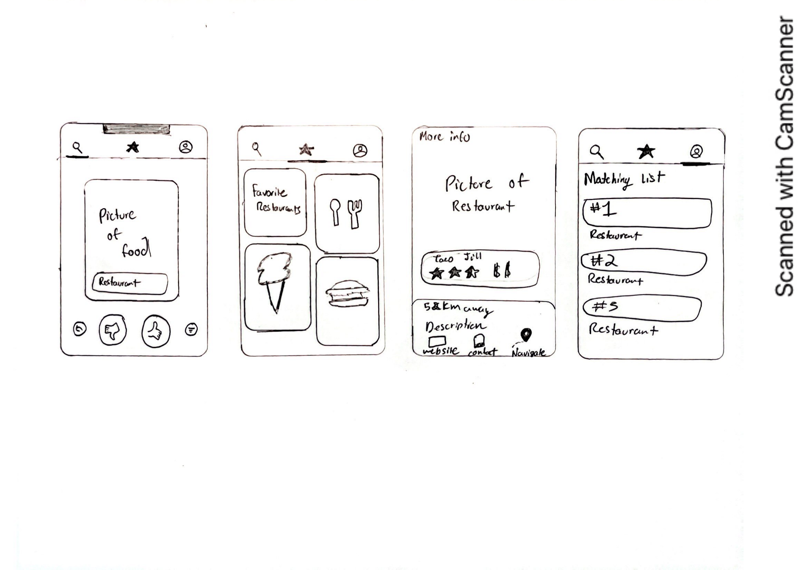

# **CoupleSync**

## Table of Contents

1. [App Overview](#App-Overview)
1. [Product Spec](#Product-Spec)
1. [Wireframes](#Wireframes)
1. [Build Notes](#Build-Notes)

## App Overview

### Description 

**CoupleSync makes dining out simple and fun for couples. With just a swipe, partners can easily agree on a restaurant. Swipe "yes" or "no" on restaurant options until a mutual favorite is found, this helps the decision-making process and ensuring a delightful dining experience.**

### App Evaluation

<!-- Evaluation of your app across the following attributes -->

- **Category:** Lifestyle
- **Mobile:** Mobile is essential, the app uses location to suggest nearby restaurants and utilizies a swiping mechanism to choose restaurants. 
- **Story:** CoupleSync brings couples closer together through their shared love of food. By simplifying the decision making process when choosing restaurants, it reduces stress and allows couples to enjoy their meals and each other’s company without the usual indecisiveness.
- **Market:** Ideal for areas with a variety of dining options and tech-savvy adults.
- **Habit:** Couples use CoupleSync regularly as part of their dining routine, whether planning special date nights or deciding on quick meal options. The app becomes a part of their lifestyle, helping them make quick decisions and discover new places together.
- **Scope:** V1 would have swipe matching features for restaurant selection. V2 will introduce a distance filter to find restaurants. V3 would incorporate a time filter that allows users to select a dining time, filtering restaurant recommendations to only include those that are open during the chosen hours. V4 would allow users to select the number of people, adding support for double dates or group meals. 

## Product Spec

### 1. User Features (Required and Optional)

Required Features:

- Restaurant Swiping: Enable users to swipe left or right on restaurants 
- Match System: Couples can match with restaurants that both users have swiped right on.
- Distance Filter: Users can set filters based on how far they are willing to travel for a meal.

Stretch Features:

- Time Filter: Allows users to filter restaurants based on the time they plan to eat, showing only those that are open during the desired dining hours.
- Description, Images, and Reviews: Allows users to scroll through high-quality images, detailed descriptions, and user-generated reviews of each dining spot 
- Rating and Rating: Users can rate and review the restaurants they visit

### 2. Chosen API(s)

- Google Maps API
  - Used for location tracking to suggest nearby restaurants.
  - Enables the distance filter feature in V2 to find restaurants within a certain radius.
- Yelp Fusion API
    - Provides access to extensive restaurant data: photos, reviews, and ratings.
    - Supports the basic restaurant swiping functionality by offering detailed, up-to-date information about dining spots.

### 3. User Interaction

Required Feature

- User swipes on restaurant profiles
  - Action: Users swipe right to "like" or left to "dislike" based on the restaurant’s photos, reviews, and other details provided via the Yelp API.
  - Result: Matches are formed when both users in a couple swipe right on the same restaurant. 
- User applies filters for distance and time
  - Action: Users adjust filter settings for how far they are willing to travel (distance filter) and the hours they are available to dine (time filter), using sliders or input fields.
  - Result: The Google Maps API updates the list of available restaurants to only show those that fit the specified distance and time criteria, simplifying the search process.

Additional Feature

- User views detailed restaurant information
    - Action: Users tap on a restaurant profile to expand and see detailed information, including photos, extensive reviews, and descriptions from Yelp.
    - Result: This allows users to gain comprehensive insights into the restaurant before deciding to swipe right or left, ensuring a better-informed decision-making process.
- User rates and reviews a restaurant
    - Action: Post-visit, users can enter their rating and write a review for the restaurant within the app.
    - Result: This review is added to the restaurant’s profile on Yelp, contributing to the community and influencing future visitors.

## Wireframes

<!-- Add picture of your hand sketched wireframes in this section -->

### [BONUS] Digital Wireframes & Mockups

### [BONUS] Interactive Prototype

## Build Notes

Here's a place for any other notes on the app, it's creation 
process, or what you learned this unit!  

For Milestone 2, include **2+ Videos/GIFs!** of the build process here

## License

Copyright **2024** **Austin Chan, Gopal Pokharel, and Harlan Phillips**

Licensed under the Apache License, Version 2.0 (the "License");
you may not use this file except in compliance with the License.
You may obtain a copy of the License at

    http://www.apache.org/licenses/LICENSE-2.0

Unless required by applicable law or agreed to in writing, software
distributed under the License is distributed on an "AS IS" BASIS,
WITHOUT WARRANTIES OR CONDITIONS OF ANY KIND, either express or implied.
See the License for the specific language governing permissions and
limitations under the License.
